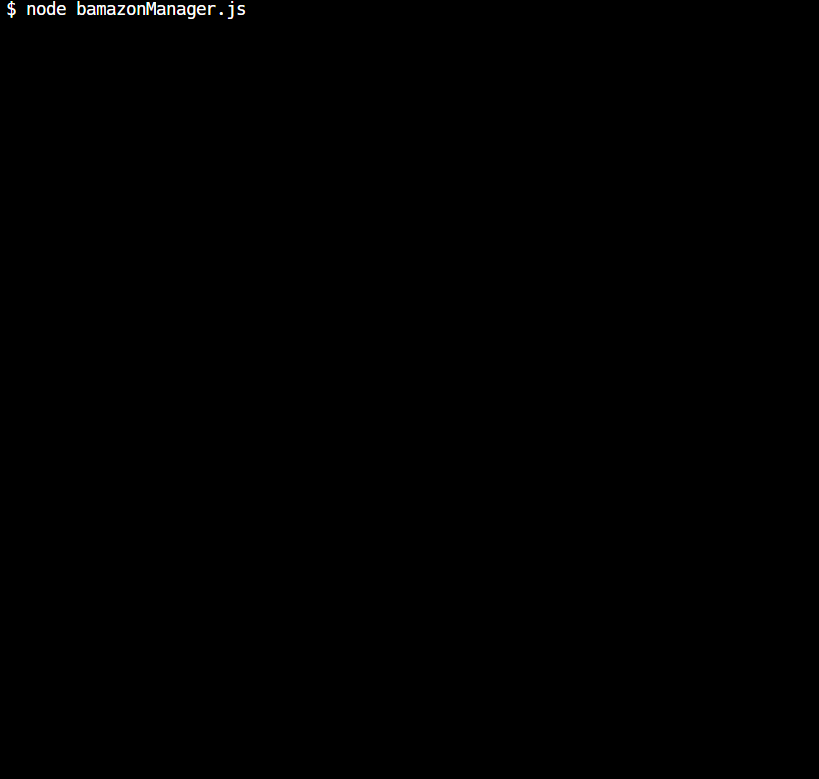
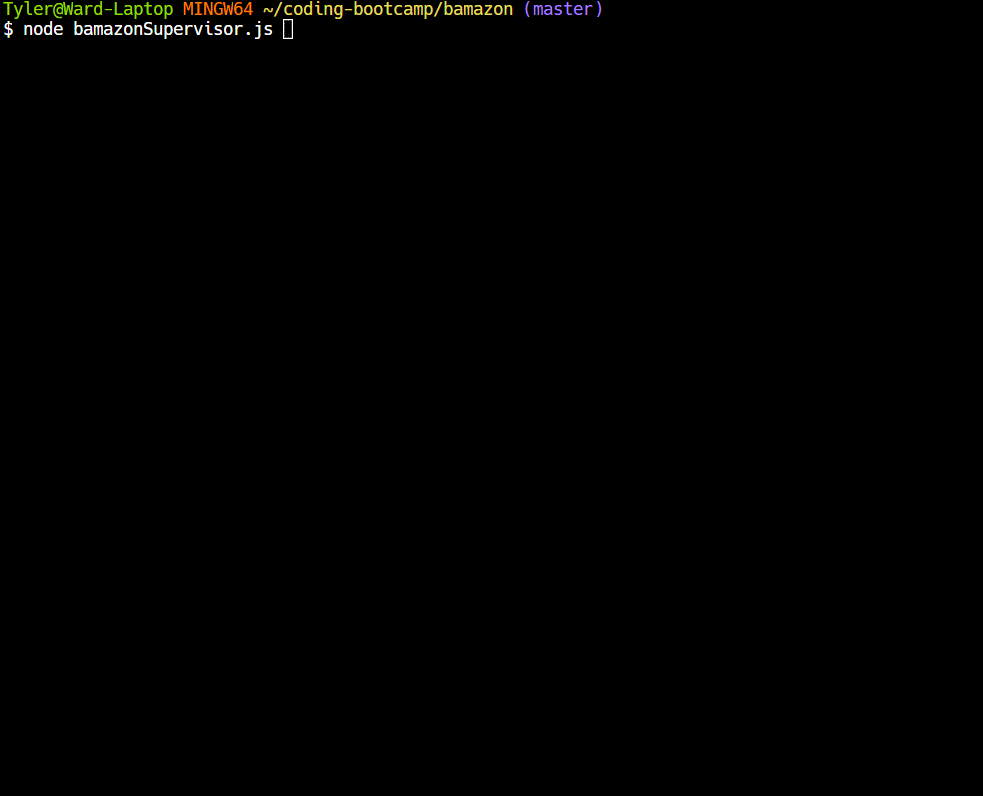

# bamazon
*Node.js and MySQL app*

## Purpose:
The purpose of this app was to learn how to connect to a MySQL database using node and perform queries to display and manipulate the data from the database using the CLI. This was done through a fake store front with 3 different Node.js files that showed how 3 different individuals might interact with the database as either a customer, manager, or supervisor for Bamazon, a fake company.

## How it works:
- BamazonCustomer.js works by requiring 3 different npm packages, mysql for connecting to the database, inquirer for prompts, and console-table-printer to pretty print the response from the products table. A connection is made to the mySQL database which performs an initial query to display the items for sale from the store front. Inquirer is then used to ask the user what item they would like to buy and how many. A query is then performed on the database to see if there is enough inventory on hand to complete their purchase. If the quantity purchased is less than the amount on hand then the purchase is completed, the customer is given the total for their order, and the product sales field for that item is updated.

- BamazonManager.js requires the same 3 packages as the customer file. Rather than printing the products available immediately like the customer file the user is presented with a list of abilities they can perform. They can view products for sale which displays the same data that the customer is given plus the quantity available is shown. They can also view low inventory which queries the database and only shows items where the quantity is 5 or less. The third option they have is add to inventory where they can chose an item and add more to quantity is is done using an UPDATE query on the database on that particular item's ID. First the current stock is queried and this value is added to the quantity the manager wants to add then the update query is performed. The last choice for managers is to add new products. They are presented with another inquirer prompt that walks them through the process and another query is performed to INSERT the new item into the products table.

- BamazonSupervisor.js also requires the same 3 packages as the other 2 files. The Supervisor is presented with 2 inital options, to view the product sales breakdown by department or to add a new department. The view product sales is accomplished by performing an inner join on the departments table and the products table using departments as the join and several aggregate functions are performed using SUM of product_sales and then also using this same SUM minus the overhead costs with a GROUP by department_name. The response from this query is then printed out in a pretty table. The other option to add a department where the supervisor is asked two simple questions then an INSERT INTO departments query is performed to add the new row to the table.

## How to use:
The customer is presented with the items currently available for sale by both name and ID number as well as a price. The customer is then asked what item they would like to buy based on ID and how many they would like to buy. If the store has enough quantity on hand to complete the order the order will be processed through and the customer will be given the total for their order. If quantity on hand is less than the quantity ordered by the customer their order will be denied.

The manager can view the current products for sale which shows a similar table to the customer but with the quantity in the inventory also displayed. Alternatively they can just see what items currently have low inventory which shows only the items that have a quantity of 5 or less.

The other options managers have is to increase the inventory of items that already exist or to add new items. If they would like to increase inventory they just need to provide the ID of the item and how many to add to the inventory. If instead they want to add a new item they are prompted for the item name, what department is belongs to, the retail price for the item, and the initial quantity.

The supervisor is presented with two options, to either view product sale breakdowns by departments or to add new departments. The view product sales provides them with a table of the total sales grouped by department as well as the overhead costs for the departments and the profit after the overhead is removed. If they would like to add a new department they are just asked for the name of the department and the overhead costs for the department.

## Contributors:
This project is maintained and contributed to solely by myself, Tyler Ward.